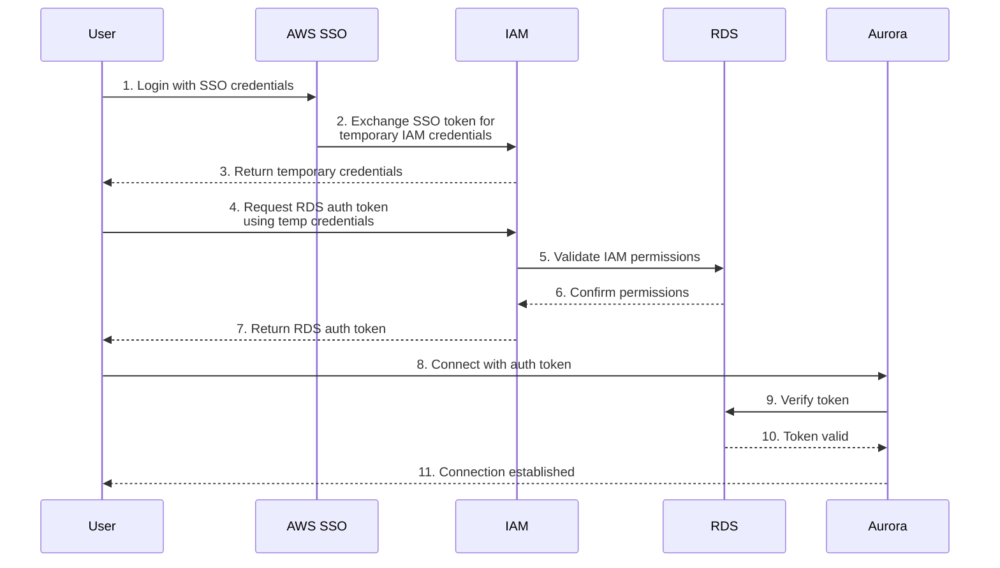

# AWS RDS IAM Authentication Setup

This project provides a set of shell scripts for setting up and managing an Amazon Aurora PostgreSQL database cluster with IAM authentication. It demonstrates how to create a database cluster, enable IAM authentication, create users, and connect to the database using IAM credentials.

## Authentication Flow



The diagram above illustrates the authentication flow:
1. User authenticates through AWS SSO
2. AWS SSO exchanges the token for temporary IAM credentials
3. User receives temporary IAM credentials
4. User requests an RDS authentication token using these credentials
5. IAM validates the user's permissions for RDS access
6. RDS confirms the permissions are valid
7. User receives the RDS authentication token
8. User connects to Aurora using the token
9. Aurora verifies the token with RDS
10. RDS confirms token validity
11. Database connection is established

## Prerequisites

- AWS CLI installed and configured
- PostgreSQL client (psql) installed (`postgresql@15` via Homebrew)
- AWS credentials with appropriate permissions
- VPC with public subnets

## Scripts Overview

### 1. create-aurora.sh
Sets up an Aurora PostgreSQL cluster with:
- Creates/uses DB subnet group in public subnets
- Creates/configures security group for database access
- Enables IAM authentication
- Configures cluster with specified settings:
  - Instance class: db.r5.large
  - Port: 5432
  - Database name: mydb

### 2. create-iam-user.sh
Creates an IAM user in PostgreSQL with:
- IAM authentication enabled
- Database access privileges
- Requires master database password

### 3. create-table.sh
Creates a sample table using IAM authentication:
- Creates 'iodine' table with columns:
  - id (SERIAL PRIMARY KEY)
  - name (VARCHAR)
  - atomic_number (INTEGER)
  - atomic_mass (DECIMAL)
  - discovery_year (INTEGER)
  - created_at (TIMESTAMP)
- Inserts sample data

### 4. connect-db.sh
Provides database connection functionality:
- Generates RDS authentication token
- Connects to database using IAM authentication
- Enables debug mode for detailed connection information

## Usage

1. Create Aurora Cluster:
```bash
./create-aurora.sh
```

2. Create IAM User:
```bash
./create-iam-user.sh
```

3. Create Sample Table:
```bash
./create-table.sh
```

4. Connect to Database:
```bash
./connect-db.sh
```

## AWS CLI Commands

Common AWS CLI commands for database management are available in `aws-cli.txt`:
- List AWS CLI profiles
- List databases
- Show table information
- Display detailed table information

## PostgreSQL CLI Commands

When connected to the database using `connect-db.sh`, you can use these PostgreSQL commands:

```sql
-- List all tables in the current database
\dt

-- List tables with more details (size, description)
\dt+

-- List all databases
\l

-- List all schemas
\dn

-- Describe a specific table
\d table_name

-- List all users and their roles
\du

-- Show current connection info
\conninfo
```

### Example SQL Queries for Iodine Table

After connecting to the database, you can run these SQL queries:

```sql
-- Select all records from iodine table
SELECT * FROM iodine;

-- Select specific columns
SELECT name, atomic_number, atomic_mass FROM iodine;

-- Select with conditions
SELECT * FROM iodine WHERE atomic_number = 53;

-- Select with ordering
SELECT * FROM iodine ORDER BY atomic_mass DESC;

-- Count records
SELECT COUNT(*) FROM iodine;

-- Get table structure
SELECT column_name, data_type, character_maximum_length
FROM INFORMATION_SCHEMA.COLUMNS
WHERE table_name = 'iodine';
```

## Security Notes

- The scripts use SSL mode `verify-full` for secure connections
- IAM authentication tokens are generated automatically
- Security group is configured to allow access only from your public IP
- Sensitive information (passwords, endpoints) should be stored securely
- Update the default password in production environments

## Environment Details

- Database Port: 5432
- Database Name: mydb
- Master Username: dbadmin
- Region: us-east-1

## Contact

For questions or support, please contact:
- AWS Team: Wei Chen (Sr. Solutions Architect, wchemz@amazon.com)
