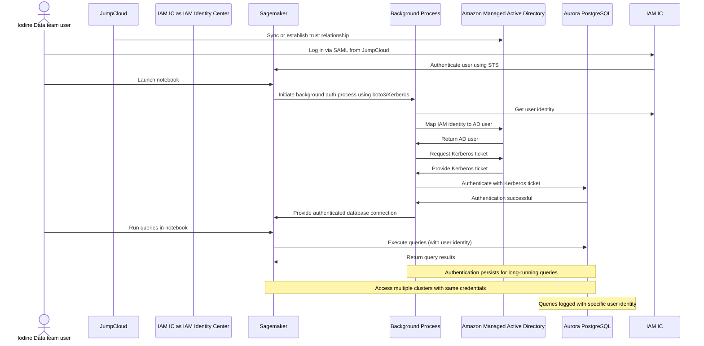

# RDS Kerberos Authentication Architecture

## Kerberos Authentication Flow

## Architecture Components

### Training Environment
- GPU AutoScaling Group for model training
- S3 buckets for storing trained models

### Model Registry
- ClearML in US-East-1 for model registry and orchestration
- Integration with S3 for model storage

### Inference Environment
- EKS on EC2 for running inference workloads
- Kubernetes for container orchestration
- CPU-based inference optimization

### Authentication Flow
1. Initial trust relationship between JumpCloud and Amazon Managed AD
2. SAML-based authentication through IAM Identity Center
3. SageMaker notebook authentication using STS
4. Kerberos ticket generation for Aurora PostgreSQL access
5. Persistent authentication for long-running queries

## Key Benefits
- Single sign-on experience for data team users
- Centralized user management through JumpCloud
- Secure access to multiple Aurora PostgreSQL clusters
- Persistent authentication for improved user experience
- Detailed query logging with user identity

## Contact

For questions or support, please contact:
- AWS Team: Wei Chen (Sr. Solutions Architect, wchemz@amazon.com)
