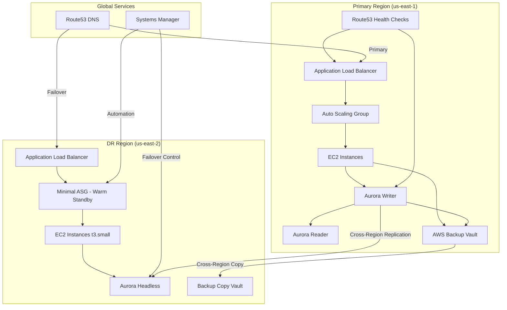

# Iodine Healthcare Platform - Multi-Region Disaster Recovery Documentation

# Table of Contents
1. [Architecture Overview](#architecture-overview)
2. [Architecture Diagram](#architecture-diagram)
3. [Detailed Architecture](#detailed-architecture)
4. [Disaster Recovery Runbook](#disaster-recovery-runbook)

# Architecture Overview
This document outlines the comprehensive disaster recovery (DR) architecture for Iodine's healthcare platform, designed to meet the following requirements:
- Recovery Time Objective (RTO): 8 hours
- Recovery Point Objective (RPO): 15 minutes
- HIPAA compliance maintenance
- Cost optimization during normal operations

# Architecture Diagram



## Key Components

### Primary Region
- Application Load Balancer for traffic distribution
- Auto Scaling Group at production capacity
- Aurora PostgreSQL writer with read replicas
- Route53 health checks for both EC2 and Aurora
- AWS Backup vault for daily snapshots and continuous backups

### DR Region
- Minimal warm standby EC2 capacity (t3.small)
- Headless Aurora cluster
- Secondary backup vault for cross-region copies
- Ready to scale up during failover

### Global Services
- Route53 for DNS failover management
- Systems Manager for automation and control
- Cross-region replication for both Aurora and backups

# Detailed Architecture

## Architecture Components

### Primary Region (us-east-1)

#### Compute Layer
- **EC2 Application Tier**
  - Auto Scaling Group with production capacity
  - Application Load Balancer for traffic distribution
  - Custom AMIs with pre-installed application stack
  - Instance types: Based on production workload requirements
  - Security groups with least privilege access

#### Database Layer
- **Aurora PostgreSQL Cluster**
  - Primary writer instance
  - Read replicas for scalability
  - IAM authentication enabled
  - Continuous backup enabled
  - Performance Insights enabled for monitoring

#### DNS Management
- **Route53**
  - Health checks configured for EC2 and Aurora endpoints
  - Weighted routing policies for testing
  - 30-second DNS TTL for fast failover
  - Private hosted zones for internal service discovery

#### Backup Management
- **AWS Backup**
  - Daily EC2 snapshots (35-day retention)
  - Continuous Aurora backups
  - EBS volume backups
  - Cross-region backup copies
  - HIPAA-compliant backup policies

### DR Region (us-east-2)

#### Compute Layer
- **EC2 Warm Standby**
  - Minimal capacity Auto Scaling Group (t3.small instances)
  - Pre-configured with application code
  - Automated scaling plans for failover
  - Spot Instances where applicable

#### Database Layer
- **Aurora PostgreSQL Cluster**
  - Headless cluster during normal operations
  - Cross-region replication from primary
  - Scaled-down compute capacity
  - Automated promotion during failover

#### DNS Failover
- **Route53**
  - Health check monitoring
  - Automated DNS failover configuration
  - Regional endpoint management
  - Failover routing policies

#### Backup Storage
- **AWS Backup**
  - Secondary backup vault
  - Cross-region backup copies
  - Automated recovery procedures
  - Backup lifecycle management

# Disaster Recovery Runbook

## Pre-Failover Checklist

### 1. Verify DR Readiness
- [ ] Confirm Aurora replication lag < 1 minute
- [ ] Verify EC2 warm standby instances are running
- [ ] Check Route53 health check status
- [ ] Validate AWS Backup completion status
- [ ] Test Systems Manager automation readiness

### 2. Access Verification
- [ ] Confirm IAM roles and permissions
- [ ] Test VPC connectivity between regions
- [ ] Verify SSL/TLS certificates
- [ ] Check security group configurations
- [ ] Validate database credentials

## Failover Procedures

### Automated Failover

#### Triggering Conditions
- Primary region health check failures
- Aurora cluster unavailability
- EC2 fleet degradation > 50%

#### Automated Actions
1. Route53 initiates DNS failover
2. Systems Manager runs failover automation
3. DR region ASG scales up
4. Aurora promotion in DR region

#### Verification Steps
1. Monitor CloudWatch metrics
2. Verify DNS propagation
3. Confirm application health checks
4. Validate database connectivity
5. Check application logs

### Manual Failover

#### Preparation
1. Notify stakeholders
2. Create incident ticket
3. Establish communication channel
4. Review current system status

#### Execution Steps
1. Run pre-failover validation
```bash
aws ssm start-automation-execution \
    --document-name "DR-PreFailoverCheck" \
    --region us-east-2
```

2. Scale up DR EC2 fleet
```bash
aws autoscaling update-auto-scaling-group \
    --auto-scaling-group-name "DR-ASG" \
    --min-size 3 \
    --max-size 10 \
    --desired-capacity 5 \
    --region us-east-2
```

3. Promote Aurora replica
```bash
aws rds failover-db-cluster \
    --db-cluster-identifier dr-aurora-cluster \
    --region us-east-2
```

4. Update Route53 DNS
```bash
aws route53 change-resource-record-sets \
    --hosted-zone-id ZXXXXXXXXXXXXX \
    --change-batch file://failover-policy.json
```

5. Verify application health
```bash
curl -v https://health-check-endpoint.example.com
```

## Recovery Procedures

### Data Validation
1. Check data consistency
2. Verify transaction logs
3. Validate backup integrity
4. Monitor replication status

### Application Recovery
1. Scale application services
2. Enable monitoring alerts
3. Test critical paths
4. Verify external integrations

### Performance Optimization
1. Adjust Aurora instance sizes
2. Tune Auto Scaling parameters
3. Optimize connection pooling
4. Review cache configurations

## Failback Procedures

### Pre-Failback Checklist
- [ ] Primary region status green
- [ ] Data replication caught up
- [ ] Application metrics stable
- [ ] Backup snapshots created

### Execution Steps
1. Scale primary region infrastructure
2. Synchronize data back to primary
3. Update DNS routing
4. Verify application functionality
5. Scale down DR region

## Emergency Contacts

### Technical Teams
- Platform Team: Kelly Yao (Sr. Director Platform Engineering)
  - kyao@iodinesoftware.com | +15108252821
- DevOps Team: Brendan Laws (Director of DevOps)
  - blaws@iodinesoftware.com | (508) 496-0651
- Security Team: Cheng Zhou (Director of SRE/InfoSec)
  - cheng@iodinesoftware.com | +15127954356
- SRE Team:
  - Chase Hoffman: choffman@iodinesoftware.com | +15128290600
  - Kevin Mooney: kmooney@iodinesoftware.com | (512) 586-7833

### Management
- Chief Product & Technology: Priti Shah
  - pshah@iodinesoftware.com | (+1)5128290600
- SVP Engineering: Sasi Mukkamala
  - smukkamala@iodinesoftware.com | +15123068407
- Enterprise Architecture: James Balling
  - jballing@iodinesoftware.com | (512) 909-6013
- Technical Architecture: Bryan Horne
  - bryan@iodinesoftware.com | +15128290600

## Appendix

### Monitoring Commands
```bash
# Check Aurora replication lag
aws rds describe-db-clusters \
    --db-cluster-identifier dr-aurora-cluster \
    --query 'DBClusters[].ReplicaLag'

# Verify EC2 health
aws ec2 describe-instance-status \
    --region us-east-2

# Test Route53 health checks
aws route53 get-health-check-status \
    --health-check-id health-check-id
```

### Recovery Time Estimates
- DNS Propagation: 5-10 minutes
- EC2 Scale-up: 10-15 minutes
- Aurora Promotion: 5-10 minutes
- Application Warm-up: 15-20 minutes
- Total RTO: < 8 hours

### Compliance Requirements
- Maintain HIPAA compliance during failover
- Document all manual interventions
- Preserve audit logs
- Update security teams
