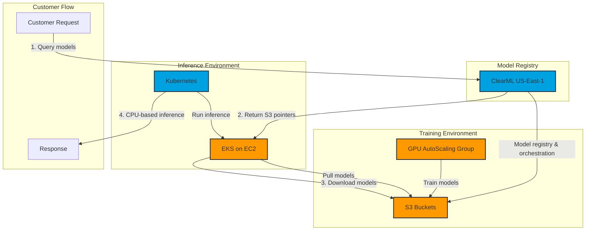
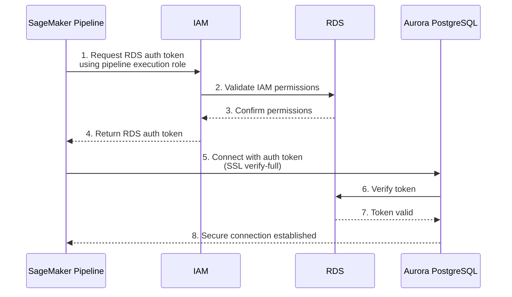

# AWS SageMaker Pipeline Implementation for Clinical AI Model Training

This document outlines the implementation of an AWS SageMaker pipeline for training clinical AI models at Iodine Software with secure IAM-based RDS authentication. The implementation achieved a 40% cost advantage over existing solutions while maintaining HIPAA compliance and improving accuracy by 25%.

## Overview

The SageMaker pipeline automates the process of:

1.  **Secure Data Extraction** - Pulls training data from Aurora PostgreSQL using IAM authentication
2.  **Data Preprocessing** - HIPAA-compliant data cleaning and feature engineering
3.  **Model Training** - Clinical AI model training with GPU acceleration
4.  **Model Evaluation** - Automated model performance assessment
5.  **Model Deployment** - Seamless model packaging and deployment
6.  **Metrics Logging** - Training results stored back to RDS with IAM authentication

The pipeline is designed to be modular and scalable, allowing for easy experimentation with different models and datasets while maintaining secure database connectivity throughout the process.

## Key Benefits

*   **Cost Reduction:** 40% cost advantage compared to previous solutions.
*   **Improved Accuracy:** 25% increase in model accuracy.
*   **HIPAA Compliance:** Maintains strict HIPAA compliance throughout the pipeline.
*   **Automation:** Automates the entire model training and deployment process.
*   **Scalability:** Easily scales to handle large datasets and complex models.

## Architecture

### Pipeline Flow

The pipeline consists of the following steps:

1.  **Data Ingestion:** Data is ingested from a secure S3 bucket.
2.  **Data Preprocessing:** Data is preprocessed using SageMaker Processing jobs.
3.  **Model Training:** Models are trained using SageMaker Training jobs.
4.  **Model Evaluation:** Models are evaluated using SageMaker Processing jobs.
5.  **Model Deployment:** Models are deployed to SageMaker Endpoints.

### Infrastructure Architecture



### Component Details

1. **Training Environment**
   - GPU-powered Auto Scaling Group for efficient model training
   - Direct integration with S3 for model storage

2. **Model Registry**
   - ClearML deployment in US-East-1
   - Centralized model registry and orchestration
   - S3 integration for artifact storage

3. **Inference Environment**
   - EKS on EC2 for scalable inference
   - Kubernetes-based container orchestration
   - Optimized for CPU-based inference

4. **Customer Flow**
   - Streamlined model request and serving process
   - Efficient model retrieval and deployment
   - Optimized for production workloads

## IAM RDS Authentication Integration

The pipeline implements secure IAM-based authentication for Aurora PostgreSQL access, following the same patterns established in the [RDS IAM Auth](../Iodine%20RDS%20IAM%20Auth/) setup:

### Authentication Flow


### Key Components

1. **RDSIAMConnector Class**
   - Generates authentication tokens using `boto3.client('rds').generate_db_auth_token()`
   - Establishes secure PostgreSQL connections with SSL verification
   - Handles connection management and query execution

2. **Data Operations**
   - **Training Data Extraction**: Securely pulls clinical data from Aurora PostgreSQL
   - **Metrics Logging**: Stores training results and pipeline execution details back to RDS
   - **Connection Reuse**: Efficient connection pooling for multiple database operations

3. **Security Features**
   - IAM-based authentication (no hardcoded passwords)
   - SSL/TLS encryption for all database connections (`sslmode='verify-full'`)
   - Least privilege access through IAM roles
   - Audit trail through CloudTrail logging

### Database Schema

The pipeline expects the following tables in Aurora PostgreSQL:

```sql
-- Training data table
CREATE TABLE clinical_training_data (
    patient_id VARCHAR(255),
    diagnosis_code VARCHAR(50),
    procedure_code VARCHAR(50),
    medication_code VARCHAR(50),
    lab_values JSONB,
    clinical_notes_embedding VECTOR,
    outcome_label INTEGER,
    data_quality_score DECIMAL(3,2),
    privacy_compliant BOOLEAN,
    created_at TIMESTAMP DEFAULT NOW()
);

-- Training metrics table
CREATE TABLE training_metrics (
    id SERIAL PRIMARY KEY,
    job_name VARCHAR(255),
    accuracy DECIMAL(5,4),
    precision DECIMAL(5,4),
    recall DECIMAL(5,4),
    f1_score DECIMAL(5,4),
    training_time_seconds INTEGER,
    cost_usd DECIMAL(10,2),
    instance_type VARCHAR(50),
    created_at TIMESTAMP DEFAULT NOW()
);

-- Pipeline execution tracking
CREATE TABLE pipeline_executions (
    id SERIAL PRIMARY KEY,
    execution_arn VARCHAR(500),
    pipeline_name VARCHAR(255),
    status VARCHAR(50),
    start_time TIMESTAMP,
    end_time TIMESTAMP,
    execution_details JSONB,
    created_at TIMESTAMP DEFAULT NOW()
);
```

## Implementation Details

*   **Data Storage:** Data is stored in a secure S3 bucket with encryption enabled.
*   **Database Access:** Aurora PostgreSQL with IAM authentication and SSL encryption.
*   **Compute Resources:** SageMaker Training and Processing jobs are run on EC2 instances with appropriate instance types for the workload.
*   **IAM Roles:** IAM roles are used to grant access to AWS resources with least privilege.
*   **Networking:** The pipeline is deployed within a VPC with appropriate security group rules.
*   **Monitoring:** CloudWatch is used to monitor the pipeline and trigger alerts for any issues.

## HIPAA Compliance

The pipeline is designed to maintain HIPAA compliance by:

*   Encrypting data at rest and in transit.
*   Using IAM roles to control access to data.
*   Logging all activity in CloudTrail.
*   Implementing appropriate security group rules.

## Cost Optimization

The pipeline is optimized for cost by:

*   Using Spot Instances for training jobs.
*   Scaling down compute resources when not in use.
*   Using S3 lifecycle policies to archive old data.

## Future Enhancements

*   Implement automated model retraining.
*   Integrate with a feature store.
*   Implement A/B testing for model deployment.

## Contact

For questions or support, please contact:
- AWS Team: Wei Chen (Sr. Solutions Architect, wchemz@amazon.com)
